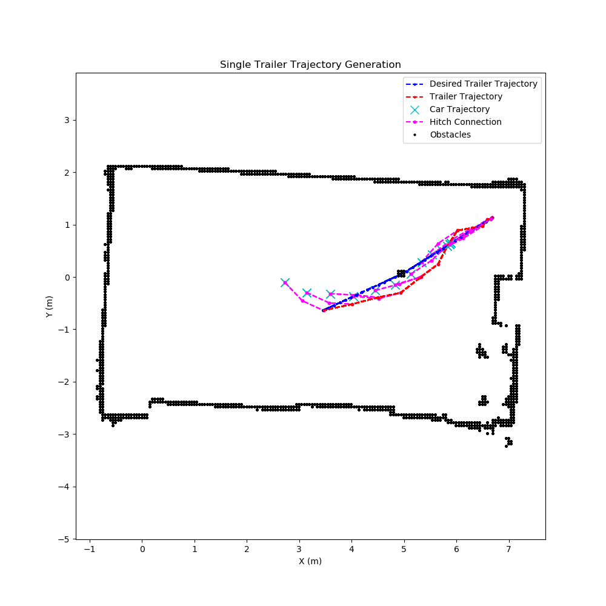
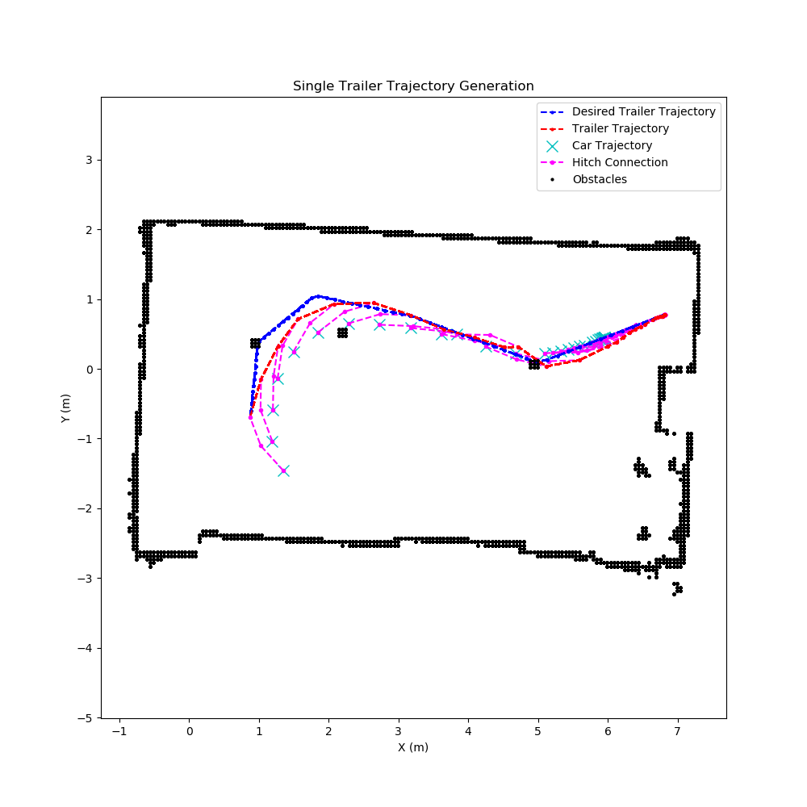

# Single Trailer Controller
This repository houses the code to our ESE-615 Final Project. Here you will find a general overview of the project, but for a more in depth explanation, please refer to the [project report](/ESE_615_Final_Project_Report.pdf). In this [drive link](https://drive.google.com/drive/folders/1KlAkgB0kzjpeIIhMbtW2n1_Oi0Y0-YaZ), you can access some videos of the car in action.

## Motivation
As self-driving cars become a reality, there will be an increasing demand for adding trailers and extensions to one's autonomous cars.

Moreover, the development of autonomous car-trailer systems can benefit the logistics and transportation industry by improving efficiency, reducing costs, and increasing safety. These systems could reduce the need for human drivers, making transportation more efficient and cost-effective while also reducing the risk of accidents caused by driver error.

Controlling the motion of a car and trailer in a coordinated manner is a complex problem that requires the development of a good control system. 

## Objective
The objective of the project is to design and build an autonomous single-trailer car that can safely and efficiently navigate through an environment with obstacles. 

To achieve this objective, we designed a control system using a non-linear trajectory optimization framework and Pure Pursuit controller that can accurately track the car-trailer system trajectory accounting for the non-linear dynamics of the system.

To test the control system, we placed obstacles like cans in the environment and built a controller that ensures the car avoids the cans while the trailer is controlled to knock-off the cans.

## Problem Formulation
The problem is formulated as a trajectory optimization problem in which the car-trailer system is controlled to follow a desired trajectory for the trailer. The trajectory is generated offline using an MPC with the objective that the trailer hit some target obstacles while the car avoids all obstacles. Once the optimized trajectory is generated offline, the car-trailer system is controlled to follow the trajectory using a Pure Pursuit controller.

## MPC Formulation
See the equations provided in the [project report](/ESE_615_Final_Project_Report.pdf) for more details, but here is a general overview
- Variables
    * State: Car Position (x, y, 𝜃), Hitch angle (α)
    * Input: Car Velocity (v, 𝜹, dt)
- Constraints
    * Initial state constraint
    * Input constraints
    * State constraints
    * Dynamics constraints
    * Obstacle constraints
- Objective Function
    * Tracking cost (for trailer)
    * Acceleration cost

## Simulation and Real World Results
We perfomed two experiments to test the performance of our controller.

### 1 Can Trajectory
The first experiment involves the car avoiding a can while the trailer hits it. The figure below shows the simulation outpua and we have a video to show the real world result. \

[](https://youtu.be/rlbMi3GKpSE)

### 3 Can Trajectory
For this experiment we placed 3 cans in the environment and the car had to avoid all of them while the trailer hit the first and third can. The figure below shows the simulation output and we have a video to show the real world result. \

[](https://youtu.be/oMXLErR5_nU)
## Runing the code
This is split into two parts. One is generating the offline optimized trajectory for the car to follow and the other is running the controller that enables the car to follow it.

### Trajectory Optimization
The trajectory optimization problem is solved via an MPC in which the dynamics of the single trailer system are accounted for. To generate the trajectory we run the following script

```bash
python3 scripts/mpc.py
```
In this file you must specify two other files: one that indicate the desired trajectory and another that provides the map and obstacles. The trajectory file must be a csv file with the following format: x-position, y-position, velocity, and yaw angle of the car; however, note that velocity is not used for this problem. The map file must be provided as the usual maps generated with the slam toolbox that has been used during the course.

### Running the Controller
Once the trajectory is generated, we can run the controller that enables the car to follow it. To do so, we run the following script for simulation
```bash
ros2 launch single_trailer_controller single_trailer_controller_launch.py
```
and the following for the real robot
```bash
ros2 launch single_trailer_controller single_trailer_controller_launch.py use_sim:=false
```


